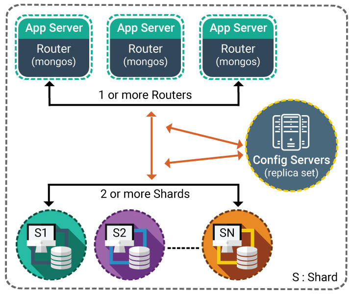

## Indexing in MongoDB

### Index Introduction
An index is required for faster retrieval of data. Indexes in MongoDB are sorted and stored as B-tree structure. There should be a balance between Indexes and queries.

Following are the index types supported in MongoDB.

+ Default_id: Each collection contains an index named default_id
+ Single Field: Indexes can be either in ascending order or descending order
+ Compound Index: used for multiple fields
+ Text indexes: To support text search queries on string content
+ Multikey Index: These are used to index array data
+ Geospatial Index: Indexes used are of 2d and 2d spheres

### How Index Works?
Working Set: Working set is a portion of data that the client is frequently accessing. Accessing disk for data is a time-consuming operation. Based on the query, multiple query plan will be created by MongoDB.

Winning query plan will be placed in the cache. This will be evicted from the cache when

+ Writes reached a threshold number
+ Rebuilding of an index is required
+ Restart of the server is needed

### Index Selection - Factors Consideration
When query in MongoDB is not indexed, a full collection scan will be performed. The absence of index can cause significant database performance degradation.

sort() method returns documents in ascending or descending order.

Performance of Index can be improved by doing the following things:

+ Documents inspected in memory should be reduced.
+ The need to perform in-memory sorts must be removed.

Following are some of the factors to be considered for an index selection include:

 + What data is written to the database
 + What kind of data is read-only
 + What piece of data are used together
 + Rich Documents

### Create and Drop Index
Create Index:

We can use ensureIndex() or createIndex() method to create an index in MongoDB.

Syntax:
```
db.collection.ensureIndex({KEY:1})
db.collection.createIndex({KEY:1})
Since version 3.0 ensureIndex() method is deprecated.
```
Example :
```
db.file.createIndex({tags: 1});
```
Drop Index:

we can use dropIndex() command to remove or drop index from collection. Default index on the _id field cannot be removed with dropIndexes() command.

Example
```
db.file.dropIndex({tags: 1});
```

### Default_id
During the creation of a collection,

MongoDB will create a unique index on the _id.

The _id index will restrict clients from inserting two documents with the same values (duplicates) for the _id field.

### Ascending/Descending - Index Sorting
Indexes can be either in ascending order or descending order.

Example:

Consider we have a collection of Player that contains score and location.
```
db.Player.insert(

{
  "_id": "1",
  "score": 10340,
  "location": { state: "NSW", city: "Sydney" }
})
```

Create Index on score

`db.Player.createIndex( { score: 1 } )`

 + 1 for index indicates scores are sorted in ascending order
 + -1 for index indicates scores are sorted in descending order.

Above created Indexes will make below query faster.
```
db.Player.find( { score: 10340} )
db.Player.find( { score: { $gt: 10000 } } )
```

### Compound Indexes
Compound indexes:

On compound indexes, there will be single index structure that holds references to multiple fields.

MongoDB has to limit restriction of 31 fields for any compound index.

`db.collectionname.createIndex( { <field1>: <type>, <field2>: <type2>, ... } )`

Example:

Consider School as a collection that contains student documents.

Each document consists of the full name of the student, subject studied and marks each scored in a particular subject.
```
try {
   db.school.insertMany( [
{ "_id" :"1", "Fullname" :"Mridhula", "subject" : "Science", "score" : 680 },
{ "_id" : "2", "Fullname" : "Mridhula", "subject" : "English", "score" : 770 },
{ "_id" :"3", "Fullname" : "Akhila", "subject" : "science", "score" : 670 },
{ "_id" : "4", "Fullname" : "Akhila", "subject" : "English", "score" : 890 },
{ "_id" :"5", "Fullname" : "Abhilasha", "subject" : "Science", "score" : 670 }
 ] );
} catch (e) {
   print (e);
};
```

Now you have to find out details of students whose subjects is sports and score greater than 670

 `db.school.find( { score: {  $gt: 670 },    subject: "sports" } )`

You can create Compound Indexes with any one option
```
db.school.createIndex({ subject: 1 ,score: 1}) 
db.school.createIndex({ score: 1,subject: 1 }) 
```

Performance will vary based on the order of fields mentioned on Compound index

### Multikey Indexes
Multikey indexes are used to make efficient queries against array fields. This can be created over arrays which hold both scalar values and nested documents.

Suppose we have Employees collection that contains details of employees with multiple skills
```
try {
   db.Employees.insertMany( [
{ "_id" :"1", "Name" :"Mridhula", "EmployeeCode" : "EC01", "Country" : "IND" ,"Skills": ["java", "oracle", "Informatica"]},
{ "_id" :"2", "Name" : "Akhila",  "EmployeeCode" : "EC02", "Country" : "US","Skills": ["java", "oracle", "Informatica"]},
{ "_id" :"3", "Name" : "Alisha", "EmployeeCode" : "EC03", "Country" : "UK", "Skills": ["java", "MongoDB", "Informatica"]},
{ "_id" :"4", "Name" : "Anwita", "EmployeeCode" : "EC04", "Country" : "IND","Skills": ["java", "Cassandra", "Informatica"] },
{ "_id" :"5", "Name" : "Ameya", "EmployeeCode" : "EC06", "Country" :"US" ,"Skills": ["java", "oracle", "Informatica"]}
   ] );
} catch (e) {
   print (e);
}
```

We can create a MultiKey Index of Skills as below.

`db.Employees.createIndex({"Skills":1});`

### Text Index
In MongoDB, Text Search is performed by stemming techniques. This technique will look for specified words in the string fields and stem the words in a collection to only store root words.

Consider the following document under Users collection, contains user_comments text and NosqlTopics, which users read through fresco play

```
{
   "user_comments": "Topics mentioned in Frescoplay for MongodDB is very 
                  informative",
   "NosqlTopics": [
      "mongodb",
      "cassandra"
   ]
}
```

### Text Search
Consider the following document under Users collection that contains user_comments text and databasenames

```
{
   "user_comments": "Topics mentioned in Frescoplay for MongodDB is very informative",
   "databasenames": [
      "mongodb",
      "cassandra"
   ]
}
```

Suppose we have to search for all the user_comments having the word MongodDB in their text.
```
db.users.find({$text:
                 {$search:"MongodDB"}})
Create Text Index on user_Comments

db.users.ensureIndex({user_comments:
                           "text"})
Compared to normal search, Text Search will improve the search efficiency.
```

### Geospatial Indexes
Geospatial indexes will reserve geospatial data as GeoJSON objects or coordinate pairs.

Syntax:
```
db.collectionname.createIndex
({<location field> : "2d"})
```

Consider we have a 2D geospatial index defined on the key location in the collection Hotel. Query to find the closest three hotels to the location 75, 245.

```
db.hotel.find({'location': 
           {$near:[75, 245]}}).limit(3)

```

### Index Properties
Few of the most common Index properties in MongoDB include:

1. Unique Index helps MongoDB to reject duplicate values for the indexed field.
2. Sparse Index ensures that only index contains entries for documents that have the indexed field. Documents that do not possess the indexed field will be skipped.
3. TTL Index is used where there is a need for automatically removing documents from a collection after a certain amount of time.
4. Parse Index Index the documents in a collection when specified filter expression is met. It is a subset of the sparse index and offers lower storage requirements and reduced performance costs for index creation and maintenance.


### Rebuild Indexes
If queries are running slow and structure of index is efficient, you can rebuild the index.
+ This operation will drop all indexes on a collection and recreate them.
+ This operation is found expensive for collections that contain a significant amount of data

`db.collectionname.reIndex()`

Example:

`db.records.reIndex()`

## Schema design

### Read Ratio/Write Ratio
Identify the business needs and design the schema for read-heavy or write-heavy.

Read-heavy

+ When an application is read-heavy, we design the schema that minimizes the number of reads from MongoDB.

Write-heavy

+ When an application is write-heavy, we must ensure that the schema designed should maximize MongoDB write throughput.

### Avoid Application Joins
Server-side joins are not supported in MongoDB.

Performance can degrade when you are pulling back and joining a lot of data.

When there is a need of so many joins, it advisable to de-normalize the schema.

### Pre-Aggregated Data
Suppose, if there is a lot of aggregation of data in application queries, you must consider pre-aggregation of the data.

Example:

Consider you have a web application and want to know how many users view a page. Rather than summing up the number of views made for a particular page on request:

+ Provide an incremental view counter for that page, each time the page is viewed.
+ Calculate the number of page views, based on this counter.

### Avoid Growing Documents
When documents created are constantly growing in size, it can impact:
+ Disk IO
+ Database performance

In such cases, perform document buckets and document pre-allocation.

### Pre-Allocated Documents (MMAP)
Suppose schema grows to a known size, in such cases, you can avoid document moves by pre-allocating the maximum size of the document.

Impact: This makes all operations on the document to be in-place update.

### Over Indexing
An index also takes up space and memory. More Indexes will be an overhead for write operations.

Game rule
+ Create schema based on how we can avoid more indexes.
+ There should be a balance between query and Indexes.

### Operational Factors and Data Models
Modeling MongoDB depends on both:
+ Data and
+ Characteristics and features of MongoDB

Along with Schema design, following factors should also be taken into consideration.
+ Document Growth
+ Atomicity
+ Storage
+ Indexing
+ Sharding

### Data Model Design
Understand different strategies that need to be considered while choosing data model, their strengths, and their weaknesses.

The key consideration for designing structure of documents is to make the decision either to use embed or references.

Embedded Data Models: This model allows storing related pieces of information in the same database record.

Use any one among the two types of Embedded Data Model
+ Model One-to-One Relationships
+ Model One-to-Many Relationships

Normalized Data Models: This data model describes relationships using references between documents.

### One-to-One Relationships Embedded Model
+ The 1:1 relationship defines a relationship between two entities.
+ With referencing, the application needs to issue multiple queries to resolve the references. Below example illustrates the advantage of embedding over referencing.
Normalized Data:

Consider we have User and addresses documents

```
---User-----
{
   _id: "Jose",
    FullName: "Jose Varghese"
}
---Addresses----
{
   user_id: "jose",
   House: "#4D Golden Flat",
   streetname: "William street",
   city: "BANGALORE",
   state: "KA",
   zip: "560060"
}
```

Embedded Data:

Suppose address data is frequently retrieved with the Fullname. In such scenario, it's better to design data model to embed the address data in the user data as mentioned below.

```
{
   _id: "Jose",
   FullName: "Jose Varghese",
   Address: {
           House: "#4D Golden Flat",
           streetname: "William street",
           city: "BANGALORE",
           state: "KA",
           zip: "560060"
            }
}
```

### One-to-Many Relationships
1:N relationship expresses a relationship where one side can hold more than one relationship whereas the reverse relationship can only be single sided.

Consider the following one-to-many relationship between user and address data, here; the user has multiple address entities.

Normalized Data:

```
---user
{
   _id: "Jose",
    FullName: "Jose Varghese"
}
---Addresses 1-----
{
   user_id: "jose",
   House: "#4D Golden Flat",
   streetname: "William street",
   city: "BANGALORE",
   state: "KA",
   zip: "560060"
}

---Addresses 2-----
{
   user_id: "jose",
   House: "1 Some other house name",
   streetname: "Alexander street",
   city: "London",
   state: "NA",
   zip: "NA"
}
```

Embedded Data:

```
{
   _id: "Jose",
   name: "Jose Varghese",
   Addresses: [
                {
            House: "#4D Golden Flat",
            streetname: "William street",
            city: "BANGALORE",
            state: "KA",
              zip: "560060"
                },
                {
        House: "1 Some other house name",
  	streetname: "Alexander street",
        city: "London",
        state: "NA",
        zip: "NA"
                }
              ]
 }
```

### Model Tree Structures
This data model describes a tree-like strong structure by storing references to parent nodes in children nodes.

```
db.BookDetails.insert( { _id: "Oracle", 
parent: "Databases" } )
db.BookDetails.insert( { _id:"Sqlserver", parent: "Databases" } )
db.BookDetails.insert( { _id:"Databases", parent: "  Programming" } )
db.BookDetails.insert( { _id:"Languages", parent: "Programming" } )
db.BookDetails.insert({_id:"Programming", parent: "Books" } )
db.BookDetails.insert({_id: "Books",
 parent: null } )
```

Books is the parent.<br>
Books > Programming .<br>
Programming > Language & Databases.<br>
Databases > SQL Server & Oracle.<br>

Query to retrieve a node's parent:

`db.BookDetails.findOne( { _id: "Oracle" } ).parent`

Query to find parent field by its immediate children nodes.

`db.BookDetails.find({parent:"Databases"})`

## Optimize Query Performance

Few query performance techniques:

Creating indexes
Limit the number of query results to decrease network demand by utilizing limit() command.
Use projections to return only necessary data
Use $hint to select a particular index
Use increment operator to perform a server-side operation
Run database profiler and find the query which is running slow and optimize the statement
Rebuild index if needed
Set maximum execution times

### Obsessions
Commonly found obsessions for query optimization of MongoDB include:
+ Bad Schema design
+ Statement tuning
+ Instance Tuning

### MongoDB Query Plan
When a user runs a query, MongoDB query optimizer processes the query and chooses the most efficient query plan.

For each query sent by a user to MongoDB, query planner will do the following steps:

```
 1. Find matching cache entry
 2. Check match found 
if match found to do the steps until 3
    2.1 Evaluate plan performance 
    2.2 if fails evict the cache and 
        go to STEP 3.1
    2.3 if pass go to STEP 3.5
    2.4.GO to STEP 3.6
3. IF not match found in STEP 2 
3.1 Generate Candidate plan
3.2 Evaluate Candidate plan
3.3 Choose a winning plan
3.4 Create cache entry
3.5 Generate results 
3.6 Send Results to a user.
```


### How MongoDB Query Plan Works?
Summary of working query plan:
+ If there are no matching entries, the query planner will generate candidate plans.
+ If a matching entry exists on STEP 2, the query planner will generate a plan and evaluate its performance through a replanning mechanism.
+ On Step 3 Onwards, query planner will choose a winning plan, and creates a cache entry containing the winning plan, and uses this to generate the result documents.

### Workload Tuning
Approach to workload tuning: 

Repeat the below processes till performance is improved.

+ Find candidates with badstatements
+ for statements in badstatements
+ do an statements.explain()
+ Identify issues and rectify

Work Load Tuning can be performed by using
+ Database Profiling
+ Explain

### Database Profiling
Database profiler helps to collect detailed information such as CRUD operations, configuration and administration commands executed against a running mongod instance.

A profiler logs information such as read and write operations, cursor operations, and other database commands in system.profile collection.

system.profile is a capped collection.

By default, the profiler is turned off.

The output of system.profile helps to find out what needs to tune from the query.

Following are some of the profiling levels that are available:

+ 0: This is the default profiler level.
+ 1: collects data for operations which is longer than the value of slowms.
+ 2: collects data for all operations.

#### Enable and Configure Database Profiling

You can pass the profiling level as a parameter and run db.setProfilingLevel() in the mongo shell.

Syntax:

`db.setProfilingLevel(<profiling Level>)`

Example 1:

db.setProfilingLevel(2)

Example 2:

This will set the profiling level to 1 and sets the slow operation threshold for the mongod instance to 25 milliseconds:ie Report anything below 25 milliseconds

`db.setprofilingLevel(1,25)`

To return only the profiling level

Syntax:

`db.getProfilingLevel()`

Check Profiling Level

Syntax:

`db.getProfilingStatus()`

Sample output looks like below

{ "was" : 0, "slowms" : 500, "sampleRate" : 5.0, "ok" : 1 }

+ was: indicates current profiling level.
+ slowms: Threshold in milliseconds
+ sampleRate: percentage of slow operations that should be profiled

#### Enabling Profiling
Enable Profiling for an entire mongod Instance

Example:

Consider the below example. This will set profiling level to 1, define slow operations that last longer than 25 milliseconds, and specify only 10% of slow operations should get profiled.

`mongod --profile 1 --slowms 25 --slowOpSampleRate 0.1`

### Explain
Explain will provide useful insight into when you are trying to optimize a query. It describes the process and indexes used to return the query.

This method will provide information on the query plan.

Syntax:

`db.collectionname.find().explain()`

`db.collectionname.explain("executionStats")`

This method helps to provide statistics about the performance of a query.

Example:

Consider School is a collection that contains student documents. You have to find the details of students whose score is greater than 670.

`db.school.find( { score: { $gt: 670 } }).explain("executionStats")`

output looks like below

```
{
 "plannerVersion" : 1,
 ...
...
           "winningPlan" : {
                  "stage" : "COLLSCAN",
                   "filter" : {
                    "score" : {
                            "$gt" : 670
                                }
                               },
                      ...
...
  "executionStats" : {
             "executionSuccess" : true,
              "nReturned" : 7,
               "executionTimeMillis" : 0,
               "totalKeysExamined" : 0,
                "totalDocsExamined" : 9,
                "executionStages" : {
                 "stage" : "COLLSCAN",
                  "filter" : {
                        "score" : {
                              "$gt" : 670
                                }
                        },
                        "nReturned" : 7,
     "executionTimeMillisEstimate" : 0,

}
```

+ queryPlanner.winningPlan.inputStage .stage : shows COLLSCAN to indicate there is no index usage.
+ executionStats.nReturned: shows 7 to indicate that the query matches and returns seven documents.
+ executionStats.totalKeysExamined: shows 0 to indicate that MongoDB scanned entrie document with the absence of a key executionStats.totalDocsExamined: display 9 to indicate that MongoDB scanned 9 documents.

### Find Long Running Queries
Finding and terminating long-running operations in MongoDB.

`db.currentOp()`

This method returns all in-progress operations on the database.

After examination, you can terminate certain operation with the following command

`db.killOp()`

Find the "opid" value and terminate the operation.

## Sharding in MongoDB

### Sharding - Overview
Sharding can be termed as the processes for distributing data across various servers for storage.

A key from the collection will be identified as shard key and splits data using that specific key.

Factors to be considered for selecting Shard Key:
+ Good Cardinality/Granularity which means selecting key should have enough values to spread the collections.
+ Common data in queries for the collection.
+ Based on the schema of data.
+ Based on Database applications query and perform write operations to be performed.

### Main Components of Sharding



This picture illustrates the main components of sharding:
+ Shards
    - Shards are useful for storing data. This will ensure high availability and data consistency.
+ Config Servers
    - This will be storing cluster's metadata. Data consist of mapping between cluster's data set with shards. This metadata will be taken by query router to target operations to specific shards.
+ Query Routers
    - Those are mongo instances, which interfaces between direct operations to the appropriate shard client applications.
    - Router processes and combines the operations to shards and then returns results to the clients.

### Shard Key
In MongoDB, you have to know that data distribution is based on ShardKey.

Shard key values will be divided into chunk that are evenly distributed across the shard.

MongoDB divides shard key values by
+ Range based Partitioning
   - Range based Partitioning will be having ranges of low to high [Klow, kHigh].

      Example:

      Consider the below example with a collection "User" that contains name {.....name...}. Here name is the sharding key.

      Metadata looks like below.
      ```

         Shard              nameLow - nameHigh
      Shard 0 (s0) :      range [jane - jose]
      Shard 1 (s1) :      range [joe - kyle ]
      Shard 3 (s2) :      range [kyle - matt]
      Shard 4 (s3) :      range [Robert- Zzzzz]
      ```

      when the user runs the below command

      `db.users.find({name:/^jo/}) `

      in that case, the search will go to only two shards s0 and s1.

+ Hash based Partitioning

   

   - MongoDB creates a hash of a field’s value and uses these hashes to create chunks.
   - This partition ensures a random distribution of a collection in the cluster by keeping two documents with close shard key values to be part of the same chunk.

### Chunk Operations
In MongoDB, all the documents with the key range is mentioned as Chunk.

Chunk operations will be performed in the background are either

- Splitting (or)
- Balancing

### How Split Works?

   

**Split**

When data has exceeded its limits, MongoDB splits the key range into two different key ranges.

This is the way MongoDB ensures that there will be no huge chunks and the data will be moved.

Example: This picture shows how split works. Consider when a chunk grows beyond 64 MB limit, it will be split into two 32 MB chunks.

**Balancer**

Balancer acts as a background process that helps to manage chunk migrations.

This can be performed from any of the mongo instances in a cluster.

When the distribution of sharded collection in a cluster became uneven, balancer migrates chunks from the largest number of chunks to least number of chunks still the collection balances.

## MongoDB Replication

### Replication Overview


In MongoDB Replication helps to synchronize data across multiple servers.

Replication is achieved by placing multiple copies of data on different database servers.

Replication assists by
+ providing Redundancy
+ increased Data availability
+ Benefits
+ Protects the database from the loss of a single server failure.
+ Helps to keep data safe with higher availability of data.
+ Downtime is not required for maintenance and Disaster Recovery (like backups, index rebuilds, compaction).

### Working of Replication


In MongoDB replication,
+ Insertion will occur in the primary node.
+ An operation will get tracked in oplog (which is part of local db – oplog.$main)
+ Secondary nodes will read data from oplog and update the respective node.
+ A group of mongod instances that host the same data set can be termed as a replica set.
+ On replica set, one node will act as a primary node, and remaining nodes will become secondary nodes.

### Fail Over

What happens during Fail Over?

During a fail-over, an election establishes for primary, and a new primary node will be elected.

Once the failed node gets recovered, it again joins back the replica set and works as a secondary node.

### Replica Set Data Synchronization
MongoDB supports two forms of data synchronization:

Initial sync to copy data to new members with the full data set, and replication for ongoing changes to the entire data set.

**Initial Sync:**

+ To copies data to new members with the full data set, MongoDB clones all databases except the local database.
+ To perform Clones mongod will scan every collection in each source database and inserts all data into its copies of these collections.

**Fault Tolerance:**

Recover when there are network or operation failures.

### Set Up a Replica Set
Following is the basic syntax for replica set.

```
mongod --port "portname" --dbpath "
Databasedatapath" --replSet 
                "Replicasetname"
```

Example:

`mongod --port 27018 --dbpath "C:\mongodb\data1" --replSet rs0`

+ Mongo client will generate rs.initiate() command to initiate a new replica set.
+ rs.conf() can be used to check the replica set configuration.
+ rs.status() can be used to check the status of the replica set.
+ db.isMaster() can be used to check connected node is primary or not.

## User and Role Management

### Create User
The db.createUser() method is used to create a new user.

Example:

Create user with roles

```
use sample
db.createUser(
   {
     user: "usertest",
     pwd: "usertest123",
     roles: [ "readWrite", "dbAdmin" ]
   }
);
```

### Update User
The db.updateUser() method is used to update the user’s profile in the database.

You can update a field which will completely replace the previous field’s values. Updates can be performed on user’s roles array.

Syntax:
```
db.updateUser(
   "<username>",
   {
     customData : { <any information> },
     roles : [
               { role: "<role>", 
           db: "<database>" } | "<role>",
               ...
             ],
     pwd: "<cleartext password>"
    },
    writeConcern: { <write concern> })
```

### Get User
The db.getUsers() method is used to return information for all users associated with a database.

Example:

```
db.getUser("mynewuser");
{
        "_id" : "test.mynewuser",
        "user" : "mynewuser",
        "db" : "test",
        "roles" : [
                {
                    "role" : "readWrite",
                     "db" : "test"
                },
                {
                      "role" : "dbAdmin",
                        "db" : "test"
                }
                    ]
}
)
```

### Drop User
db.dropUser() removes the user from the current database.


Example:

Below operation drops the User1 user on the sample database.

```
use sample

db.dropUser("User1", {w: "majority", 
      wtimeout: 2000})
```

### Grant Roles to User
db.grantRolesToUser() grants additional roles to a user.

Syntax:
```
 db.grantRolesToUser( "<username>", [ <roles> ], { <writeConcern> } )
```

Example:

Below operation gives Usr01,

readWrite role on the Books database

read role on the Film database.
```
use Books
db.grantRolesToUser(
   "Usr01",
   [ "readWrite" ,{ role: "read", 
     db: "Film" } ],
   { w: "majority" , wtimeout: 2000 }
)
```

### Revoke Role from User
db.revokeRolesFromUser() removes one or more roles from a user on the current database.

Syntax :
```
db.revokeRolesFromUser( "<username>", [ <roles> ], { <writeConcern> } )
```

Example:

The following command will remove
```
read role on the film database
readWrite role on the Books database

use Books
db.revokeRolesFromUser( "accountUser01",
                        [ { role: "read", db: "film" 
                          }, 
                        "readWrite"
                        ],
                        { w: "majority" }
                      )
```

## MongoDB with external calls

Mongo Connectivity

+ You will be unable to use JDBC API to interact with MongoDB from Java.
+ Instead Mongo Java Driver API could be used as a driver.

### How to Connect to MongoDB?
In MongoDB, MongoClient class is used for connecting to a MongoDB server and perform database-related operations.

```

MongoClient mongoClient = 
                      new MongoClient();
In the above scenario, MongoClient instance connects to default MongoDBserver


MongoClient mongoClient = new 
MongoClient("abcd.server.com", 27017);
```
In this scenario, MongoDB server listens to a specific port 27017.

### Connect to a replica set of servers:
```
List<ServerAddress> servername = new 
        ArrayList<ServerAddress>();
servername.add(new ServerAddress(
           "ab.server.com", 27017));
servername.add(new ServerAddress(
      "abcd.server.com", 27019));


 MongoClient mongoClient = new 
        MongoClient(servername);
```

Example

```
Example
public class SampleDBConnection {
 
  public static void main(String[] args) {
        try {
             

 /****  MongoDB Connection ****/
       //  uses MongoClient
            MongoClient mongodbClients = new MongoClient("localhost", 27017);
           
        /**** Get database ****/
            
            List<String> databases = 
 mongodbClients.getDatabaseNames();
           
            for (String mdbNames :
       databases) {
                   System.out.println("- 
                Databases: " + mdbNames);            
   DB mdb = mongoClient.getDB(mdbNames);
        /**** Get collection ****/
          Set<String> collectionnames = 
        mdb.getCollectionNames();
                for (String colNames
            : collectionnames) {
            System.out.println("\t + 
Collection: " + colNames);
                               }
            }
             
            mongodbClients.close();
             
        } catch (UnknownHostException ex) 
{
            ex.printStackTrace();
        }
        
```